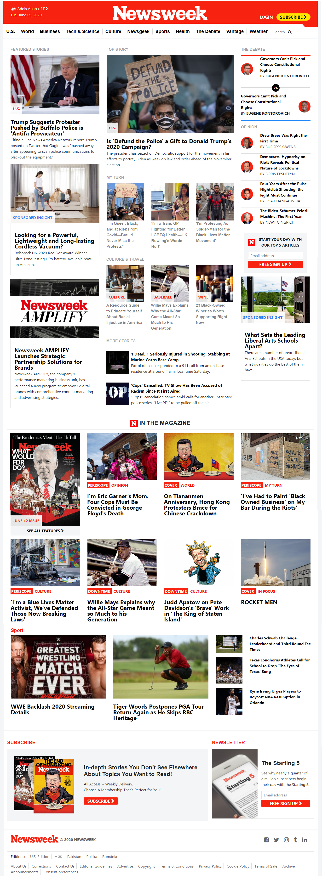

# Positioning and Floating element

> This project is a clone of the [Newsweek](https://www.newsweek.com/) home page.
> 
## Navigation bar

- There are two navbars that show in two rows and a third one that shows up while scrolling down a bit
- Logo resizes itself upon scrolling

## Main Body

- There is a three column layout body with different height columns below the nav bars
- The three column layout shrinks to two and one column layouts for smaller screen widths
- There are In the magazine and Editor's picks sections that change between 4 column and 1 column layouts
- There are then repetitive sections that change between 3 column and 1 column layouts
- The 2 column and 1 column layouts of subscribe and newsletter sections then follow

## Footer

- The footer has 3 rows
- The top row has left and right aligned content and the others follow normal flow

## Built With

- HTML5
- CSS3

## Getting Started

**Open index.html in the browser**

## Authors

:bust_in_silhouette: **@DejazmachMolla**

- Github: [@githubhandle](https://github.com/DejazmachMolla)
- Twitter: [@twitterhandle](https://twitter.com/DJATSS)
- Linkedin: [linkedin](https://www.linkedin.com/in/dejazmach-getachew-027aabaa/)

## :handshake: Contributing

Contributions, issues and feature requests are welcome!
Feel free to check the [issues page](issues/).

## Show your support

Give a :star:️ if you like this project!

## Acknowledgments

- Microverse Using Bootstrap project.

## :memo: License

This project is [MIT](lic.url) licensed.
